# GCP Production Infrastructure Diagram

This diagram represents the Terragrunt-managed infrastructure in `gcp/prod`.

```mermaid
graph TB
    subgraph "GCP Organization"
        subgraph "BCDE-Host-Prd Project<br/>bcde-host-prd-f39f9"
            VPC[Shared VPC<br/>bcde-shared-vpc-prd]
            
            subgraph "eu-west2 Region"
                subgraph "Networking"
                    NAT[Cloud NAT<br/>bcde-natgw]
                    ROUTER[Cloud Router]
                    
                    subgraph "Subnets"
                        SUBNET_APP[Application Subnet]
                        SUBNET_GKE[GKE Subnet<br/>bcde-subnet-gke-prd]
                        SUBNET_GKE_ILB[GKE ILB Subnet<br/>bcde-subnet-gke-ilb-prd]
                        SUBNET_MGMT[Management Subnet]
                        SUBNET_MIGRATE[Migrate to VM Subnet]
                        SUBNET_RDS[RDS Regional Proxy]
                        SUBNET_PSC[Private Service Connect<br/>skysql-psc]
                    end
                    
                    NETAPP[NetApp Storage<br/>- Storage Pool<br/>- Volumes<br/>- Backup Vault<br/>- Backup Policy]
                end
                
                subgraph "VPN Connections"
                    VPN_AWS[VPN to AWS Prod]
                    VPN_AZURE[VPN to Azure UKS]
                    VPN_DUBLIN[VPN to Bentley Dublin]
                end
            end
            
            subgraph "au-southeast1 Region"
                SUBNET_APP_AU[Application Subnet]
                NAT_AU[Cloud NAT]
                ROUTER_AU[Cloud Router]
            end
            
            subgraph "eu-north2 Region"
                SUBNET_APP_EU_N[Application Subnet]
                NAT_EU_N[Cloud NAT]
                ROUTER_EU_N[Cloud Router]
            end
            
            subgraph "Global Resources"
                DNS[Cloud DNS<br/>bcdemas]
                DNS_POLICY[DNS Response Policy]
                FW[Firewall Policies]
                SECRETS_HOST[Secrets Manager<br/>- SSL Certificates<br/>- FreeIPA Keys]
                PSA[Private Service Access]
                SVC_PROJECTS[Service Projects<br/>- Application<br/>- GKE<br/>- Management]
            end
        end
        
        subgraph "BCDE-Application-Prd Project<br/>bcde-prd-d38fa"
            subgraph "eu-west2 App Region"
                ALB_EUW2[Application Load Balancer<br/>alb-euw2-01]
                ALB_IP_EUW2[Public IP Address]
                SSL_POLICY_EUW2[SSL Policy<br/>TLS 1.2 Modern]
                
                ALB_FRONTEND_EUW2[ALB Frontend]
                
                subgraph "ALB Backend Services"
                    BE_APP01[bceuw201app01/02]
                    BE_APP24[bceuw201app24]
                    BE_APP41[bceuw201app41-49]
                    BE_BAM[bceuw201bamapp41]
                    BE_BB[bceuw201bbapp41-43]
                    BE_BBV[bceuw201bbvapp41-42]
                    BE_BIR[bceuw201birapp41]
                    BE_BMB[bceuw201bmbapp01]
                    BE_CON[bceuw201con01]
                    BE_CST[bceuw201cstapp41-43]
                    BE_GEO[bceuw201geo41]
                    BE_NH[bceuw201nhapp41]
                    BE_PRI[bceuw201priapp41]
                    BE_SWS[bceuw201swsapp41]
                    BE_TW[bceuw201twapp01/41]
                    BE_UU[bceuw201uuapp21/41]
                    BE_291[bceuw291app41/42/80/99]
                    BE_BRA[bceuw2bra02]
                end
                
                subgraph "GCE Instances eu-west2"
                    GCE_APP[App Servers<br/>Multiple instances]
                    GCE_BRA[BRA Servers]
                    GCE_CON[CON Servers]
                    GCE_DB[Database Servers]
                    GCE_DTS[DTS Servers]
                    GCE_FSP[FSP Servers]
                    GCE_GEO[GEO Servers]
                end
                
                CERTS_EUW2[SSL Certificates<br/>- collaborate-ms<br/>- lowerthamescrossing<br/>- wildcard.withbc.com<br/>- ongcplus.com]
                
                PSC_SKYSQL[Private Service Connect<br/>to SkySQL]
                SKYSQL[SkySQL Database<br/>bceuw2skysql01]
            end
            
            subgraph "au-southeast1 App Region"
                ALB_AUSE[Application Load Balancer<br/>alb-ause1-01]
                ALB_IP_AUSE[Public IP Address]
                SSL_POLICY_AUSE[SSL Policy<br/>TLS 1.2 Modern]
                ALB_FRONTEND_AUSE[ALB Frontend]
                BE_APP_AUSE[Backend: bcause101app41]
                GCE_APP_AUSE[GCE App Servers<br/>bcause101app41]
                CERTS_AUSE[SSL Certificates<br/>- wildcard.withbc.com]
            end
            
            subgraph "eu-north2 App Region"
                ALB_EUN[Application Load Balancer]
                SSL_POLICY_EUN[SSL Policy<br/>TLS 1.2 Modern]
                GCE_APP_EUN[GCE App Servers<br/>bceun201app41]
                CERTS_EUN[SSL Certificates<br/>- wildcard.withbc.com]
            end
            
            subgraph "Global App Resources"
                SA_APP[Service Accounts<br/>- app_vm_sa<br/>- bra_vm_sa<br/>- con_vm_sa<br/>- db_vm_sa<br/>- dts_vm_sa<br/>- fsp_vm_sa<br/>- geo_vm_sa<br/>- vm_sa]
                IAM_APP[IAM Policies]
            end
        end
        
        subgraph "BCDE-Gke-Prd Project<br/>bcde-gke-prd-2d2f8"
            subgraph "eu-west2 GKE Region"
                GKE[GKE Private Cluster<br/>bcde-gke<br/>- 2x Node Pools: blue/green<br/>- e2-standard-2 instances<br/>- Workload Identity enabled]
                
                subgraph "GKE Applications"
                    ARGOCD[ArgoCD<br/>argocd.gke.devbcde.org<br/>Namespace: argocd]
                    ATLANTIS[Atlantis<br/>atlantis.gke.devbcde.org:4141<br/>Namespace: atlantis]
                    GRAFANA[Grafana<br/>grafana.gke.devbcde.org<br/>Namespace: monitoring]
                    ALLOY[Alloy<br/>alloy.gke.devbcde.org]
                    LOKI[Loki<br/>Namespace: loki]
                end
            end
            
            GKE_SA[Workload Identity SA<br/>gke-workload-identity-sa]
            CERT_MANAGER[Cert-Manager<br/>Issuer: letsencrypt-prod]
        end
        
        subgraph "BCDE-Management-Prd Project<br/>bcde-management-prd-6f80b"
            subgraph "eu-west2 Management"
                GCE_FREEIPA[FreeIPA Servers]
                GCE_REPO[Repository Servers]
                GCE_OTHER[Other Management VMs]
            end
            
            subgraph "eu-north2 Management"
                GCE_MGMT_EUN[Management VMs]
            end
            
            SA_REPO[Service Account<br/>repo_vm_sa]
        end
    end
    
    %% Connections
    VPC -.->|Service Project| BCDE_APP_PROJECT[Application Project]
    VPC -.->|Service Project| BCDE_GKE_PROJECT[GKE Project]
    VPC -.->|Service Project| BCDE_MGMT_PROJECT[Management Project]
    
    SUBNET_APP --> GCE_APP
    SUBNET_APP --> GCE_BRA
    SUBNET_APP --> GCE_CON
    SUBNET_APP --> GCE_DB
    SUBNET_APP --> GCE_DTS
    SUBNET_APP --> GCE_FSP
    SUBNET_APP --> GCE_GEO
    
    SUBNET_GKE --> GKE
    SUBNET_MGMT --> GCE_FREEIPA
    SUBNET_MGMT --> GCE_REPO
    SUBNET_MGMT --> GCE_OTHER
    
    ROUTER --> NAT
    VPN_AWS --> ROUTER
    VPN_AZURE --> ROUTER
    VPN_DUBLIN --> ROUTER
    
    ALB_IP_EUW2 --> ALB_FRONTEND_EUW2
    ALB_FRONTEND_EUW2 --> BE_APP01
    ALB_FRONTEND_EUW2 --> BE_APP41
    ALB_FRONTEND_EUW2 --> BE_BAM
    ALB_FRONTEND_EUW2 --> BE_BB
    ALB_FRONTEND_EUW2 --> BE_BBV
    ALB_FRONTEND_EUW2 --> BE_CON
    ALB_FRONTEND_EUW2 --> BE_CST
    ALB_FRONTEND_EUW2 --> BE_BRA
    
    BE_APP01 --> GCE_APP
    BE_CON --> GCE_CON
    BE_BRA --> GCE_BRA
    
    PSC_SKYSQL -.->|Private Connection| SKYSQL
    CERTS_EUW2 --> ALB_FRONTEND_EUW2
    SSL_POLICY_EUW2 --> ALB_FRONTEND_EUW2
    
    ALB_IP_AUSE --> ALB_FRONTEND_AUSE
    ALB_FRONTEND_AUSE --> BE_APP_AUSE
    BE_APP_AUSE --> GCE_APP_AUSE
    CERTS_AUSE --> ALB_FRONTEND_AUSE
    SSL_POLICY_AUSE --> ALB_FRONTEND_AUSE
    
    GKE --> ARGOCD
    GKE --> ATLANTIS
    GKE --> GRAFANA
    GKE --> ALLOY
    GKE --> LOKI
    
    CERT_MANAGER -.->|Manages Certs| ARGOCD
    CERT_MANAGER -.->|Manages Certs| ATLANTIS
    CERT_MANAGER -.->|Manages Certs| GRAFANA
    
    SA_APP -.->|Assigned to| GCE_APP
    SA_REPO -.->|Assigned to| GCE_REPO
    GKE_SA -.->|Workload Identity| GKE
    
    NETAPP -.->|Shared Storage| GCE_APP
    DNS -.->|DNS Resolution| ALB_EUW2
    DNS -.->|DNS Resolution| GKE
    FW -.->|Security Rules| VPC

    classDef project fill:#e1f5ff,stroke:#01579b,stroke-width:2px
    classDef network fill:#fff3e0,stroke:#e65100,stroke-width:2px
    classDef compute fill:#f3e5f5,stroke:#4a148c,stroke-width:2px
    classDef storage fill:#e8f5e9,stroke:#1b5e20,stroke-width:2px
    classDef security fill:#fce4ec,stroke:#880e4f,stroke-width:2px
    classDef k8s fill:#e0f2f1,stroke:#004d40,stroke-width:2px
    
    class VPC,SUBNET_APP,SUBNET_GKE,SUBNET_GKE_ILB,SUBNET_MGMT,NAT,ROUTER network
    class GCE_APP,GCE_BRA,GCE_CON,GCE_DB,GCE_DTS,GCE_FSP,GCE_GEO,GCE_FREEIPA,GCE_REPO,GCE_OTHER compute
    class NETAPP,SKYSQL storage
    class FW,SECRETS_HOST,SA_APP,SA_REPO,GKE_SA security
    class GKE,ARGOCD,ATLANTIS,GRAFANA,ALLOY,LOKI,CERT_MANAGER k8s
```

## Infrastructure Overview

### Projects Structure

The production environment consists of 4 GCP projects:

1. **BCDE-Host-Prd** (`bcde-host-prd-f39f9`)
   - Host project for Shared VPC
   - Manages networking, VPN, Cloud NAT, subnets
   - Contains NetApp storage infrastructure
   - Manages DNS, firewall policies, and secrets

2. **BCDE-Application-Prd** (`bcde-prd-d38fa`)
   - Service project attached to Shared VPC
   - Hosts application workloads across 3 regions
   - Contains Application Load Balancers with multiple backend services
   - Manages GCE instances for various applications
   - Integrates with SkySQL via Private Service Connect

3. **BCDE-Gke-Prd** (`bcde-gke-prd-2d2f8`)
   - Service project attached to Shared VPC
   - Hosts GKE private cluster with blue/green node pools
   - Runs infrastructure tools: ArgoCD, Atlantis, Grafana, Loki
   - Uses Workload Identity for secure access
   - Domain: `*.gke.devbcde.org`

4. **BCDE-Management-Prd** (`bcde-management-prd-6f80b`)
   - Service project attached to Shared VPC
   - Hosts management infrastructure
   - Contains FreeIPA servers, repository servers

### Regional Distribution

- **eu-west2** (Primary): Full stack including ALB, GKE, GCE instances, NetApp storage
- **au-southeast1**: Application load balancers and GCE instances
- **eu-north2**: Application load balancers and GCE instances

### Key Components

- **Shared VPC**: Centralized network management across all service projects
- **VPN Connections**: Links to AWS Prod, Azure UKS, and Bentley Dublin office
- **Application Load Balancers**: 35+ backend services routing to various application tiers
- **GKE Cluster**: Private cluster running GitOps and monitoring tools
- **NetApp Storage**: Enterprise file storage with backup policies
- **SkySQL Database**: Managed MariaDB service via Private Service Connect
- **SSL Certificates**: Multiple domain certificates managed across regions

### Application Tiers

Backend services support various application types:
- **APP**: General application servers
- **BRA**: BRA application servers
- **CON**: Connection/integration servers
- **DB**: Database servers
- **DTS**: Data transfer services
- **FSP**: FSP application servers
- **GEO**: Geospatial services
- **CST**: Custom application servers
- **UU**, **TW**, **NH**, **PRI**, **SWS**, **BB**, **BBV**, **BIR**, **BMB**, **BAM**: Specialized application workloads

